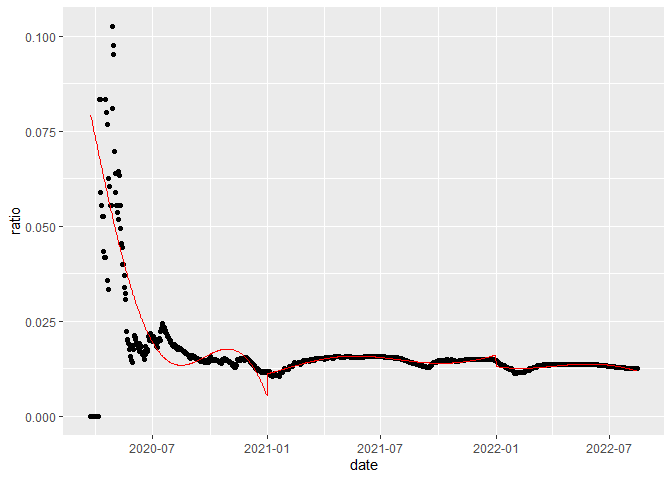
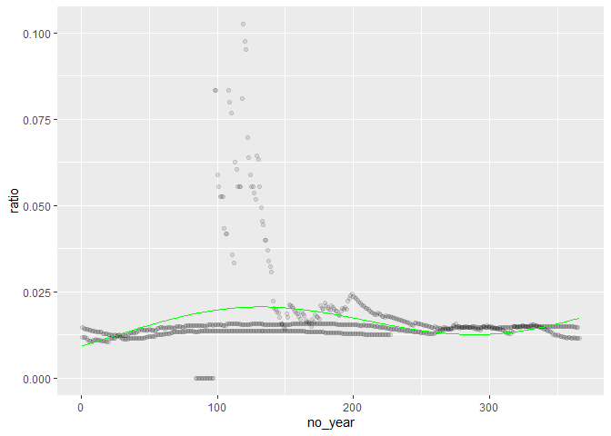
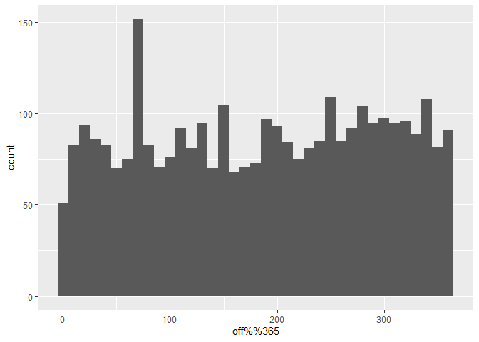

COVID-19 Morbidity and Seasonal Trends
================
Charles Fraley
2022-08-16

# Goal of Analysis

I’ll be evaluating if there’s a latitude influenced seasonal aspect to
COVID mortality rates. This question is influenced by the knowledge that
weather and climate has an influence on respiratory illness. If COVID
deaths are largely related to respiratory distress, there may be a
notable trend.

# Data

<!-- Was the source and a short description of the data provided? -->

## Intake and Source

I’ll be using the [time series COVID-19
Data](https://github.com/CSSEGISandData/COVID-19/tree/master/csse_covid_19_data/csse_covid_19_time_series)
from the Center for Systems Science and Engineering at Johns Hopkins.

``` r
url_in <- "https://github.com/CSSEGISandData/COVID-19/raw/master/csse_covid_19_data/"
time_path <- "csse_covid_19_time_series/time_series_covid19_"
time_filenames <- c(
    "confirmed_US.csv",
    #"confirmed_global.csv",
    #"deaths_global.csv",
    "deaths_US.csv"
)
for (branch_url in time_filenames) {
  time_data <- read.csv(
    url(
      paste(url_in,time_path,branch_url,sep="")
      )
    )
  assign(
    substring(branch_url,1,nchar(branch_url)-4),
    time_data
    )
}
```

# Demonstration of Method

I will be demonstrating my analysis using a single data entry:

    ## [1] "Autauga, Alabama, US"

A new data frame for each row is made using each row from the confirmed
and death spreadsheets. I use dates from either file’s column headers.
As dates come in the form of `Xmm-dd-yy` format, there is some
transformation required to get a date object. We get the mortality ratio
from
.
We remove any measurement of mortality ratio that is undefined or 0 as
these can be considered an issue of measurement from early in the
pandemic.

``` r
working_df <- data.frame(
  date = colnames(deaths_US[-(1:12)]),
  confirmed=as.numeric(
      t(confirmed_US[1,])[-(1:11)]
     ),
  dead=as.numeric(t(deaths_US[1,])[-(1:12)])
)
working_df$date <- mdy(substring(working_df$date,2))
working_df <- mutate(working_df,ratio=dead/confirmed)
working_df <- mutate(working_df,datenum=as.numeric(date-mdy("12-31-2019")))
working_df <- mutate(working_df,no_year=yday(date))
working_df <- na.omit(working_df)
# is.finite(working_df$ratio) & working_df$ratio!=0
```

<!-- -->

I’ll be trying to fit this data to the below formula.
-C_{trend}*t+C_{Intercept\ offset}")

I considered 2 approaches to this question: 1. Fit all data to one time
axis with one fit. 2. Separate time data by year and create 3 different
fits per year. 3. Combine all data into one “combined year”. As the time
axis, use only the number of days since January 1st of that year.

## 1. Fit all data to one time axis with one fit

This would be the most intuitive way to handle it, handling all data as
a single trend that can be considered.
<!-- TODO figure out what's with this --> From our working dataframe
assign a fit:

<details>

``` r
full_model <- nls(
  ratio ~ a*sin((2*pi*datenum+b)/365)-c*datenum+d, 
  data=filter(working_df,is.finite(ratio),ratio!=0),
  start=list(
    a=.001,
    b=-30,
    c=.001,
    d=.012
    )
  )
print(summary(full_model))
```

    ## 
    ## Formula: ratio ~ a * sin((2 * pi * datenum + b)/365) - c * datenum + d
    ## 
    ## Parameters:
    ##     Estimate Std. Error t value Pr(>|t|)    
    ## a  4.740e-03  4.264e-04   11.12   <2e-16 ***
    ## b -2.484e+03  3.305e+01  -75.17   <2e-16 ***
    ## c  1.964e-05  1.210e-06   16.23   <2e-16 ***
    ## d  2.666e-02  7.074e-04   37.68   <2e-16 ***
    ## ---
    ## Signif. codes:  0 '***' 0.001 '**' 0.01 '*' 0.05 '.' 0.1 ' ' 1
    ## 
    ## Residual standard error: 0.008778 on 857 degrees of freedom
    ## 
    ## Number of iterations to convergence: 9 
    ## Achieved convergence tolerance: 4.133e-07

</details>

The fit plotted against raw data.
<!-- -->

## 2. Exploration of Multiple Separate Year Evaluation

To avoid trying to model larger trends in the pandemic, we can take each
year as a separate thing to model and use a more basic linear trend to
mitigate that effect.

1.  Separate year as own variable

``` r
working_df <- mutate(working_df, year=year(date))
```

2.  Similar handling except run 3 times. Separating model by year.

<details>

``` r
model2020 <- nls(
  ratio ~ a*sin((2*pi*no_year+b)/365)-c*no_year+d, 
  data=filter(working_df,is.finite(ratio),ratio!=0,year==2020),
  start=list(
    a=.001,
    b=0,
    c=.001,
    d=.012
    )
  )
print(summary(model2020))
```

    ## 
    ## Formula: ratio ~ a * sin((2 * pi * no_year + b)/365) - c * no_year + d
    ## 
    ## Parameters:
    ##     Estimate Std. Error t value Pr(>|t|)    
    ## a -2.553e-02  2.054e-03  -12.43   <2e-16 ***
    ## b  8.651e+03  2.207e+01  392.02   <2e-16 ***
    ## c  3.526e-04  2.372e-05   14.87   <2e-16 ***
    ## d  1.091e-01  5.539e-03   19.71   <2e-16 ***
    ## ---
    ## Signif. codes:  0 '***' 0.001 '**' 0.01 '*' 0.05 '.' 0.1 ' ' 1
    ## 
    ## Residual standard error: 0.008945 on 265 degrees of freedom
    ## 
    ## Number of iterations to convergence: 8 
    ## Achieved convergence tolerance: 3.927e-07

``` r
model2021 <- nls(
  ratio ~ a*sin((2*pi*no_year+b)/365)-c*no_year+d, 
  data=filter(working_df,is.finite(ratio),ratio!=0,year==2021),
  start=list(
    a=.001,
    b=-30,
    c=.001,
    d=.012
    )
  )
print(summary(model2021))
```

    ## 
    ## Formula: ratio ~ a * sin((2 * pi * no_year + b)/365) - c * no_year + d
    ## 
    ## Parameters:
    ##     Estimate Std. Error t value Pr(>|t|)    
    ## a  2.038e-03  5.675e-05   35.90   <2e-16 ***
    ## b -1.736e+02  7.794e+00  -22.27   <2e-16 ***
    ## c -1.350e-05  4.067e-07  -33.20   <2e-16 ***
    ## d  1.200e-02  7.912e-05  151.63   <2e-16 ***
    ## ---
    ## Signif. codes:  0 '***' 0.001 '**' 0.01 '*' 0.05 '.' 0.1 ' ' 1
    ## 
    ## Residual standard error: 0.0005127 on 361 degrees of freedom
    ## 
    ## Number of iterations to convergence: 4 
    ## Achieved convergence tolerance: 4.388e-06

``` r
model2022 <- nls(
  ratio ~ a*sin((2*pi*no_year+b)/365)-c*no_year+d, 
  data=filter(working_df,is.finite(ratio),ratio!=0,year==2022),
  start=list(
    a=.001,
    b=-30,
    c=.001,
    d=.012
    )
  )
print(summary(model2022))
```

    ## 
    ## Formula: ratio ~ a * sin((2 * pi * no_year + b)/365) - c * no_year + d
    ## 
    ## Parameters:
    ##     Estimate Std. Error t value Pr(>|t|)    
    ## a  2.269e-03  2.134e-04  10.636  < 2e-16 ***
    ## b -5.964e+02  1.668e+01 -35.743  < 2e-16 ***
    ## c  2.300e-05  2.621e-06   8.776 4.48e-16 ***
    ## d  1.531e-02  3.030e-04  50.523  < 2e-16 ***
    ## ---
    ## Signif. codes:  0 '***' 0.001 '**' 0.01 '*' 0.05 '.' 0.1 ' ' 1
    ## 
    ## Residual standard error: 0.0005111 on 223 degrees of freedom
    ## 
    ## Number of iterations to convergence: 8 
    ## Achieved convergence tolerance: 1.161e-06

</details>
<details>

``` r
working_df$split_fit <-  unlist(
  c(
    predict(
      model2020,
      filter(working_df,year==2020), 
      interval='confidence'
    ),
    predict(
      model2021,
      filter(working_df,year==2021), 
      interval='confidence'
    ),
    predict(
      model2022,
      filter(working_df,year==2022), 
      interval='confidence'
    )
  )
)

split_demo <- ggplot(working_df,aes(x=date,y=ratio))+geom_point()

split_demo <- split_demo+
  geom_line(aes(date,working_df$split_fit),color="red")
```

</details>

<!-- -->

I did not use this in final analysis as the split is artificial and
arbitrary. I worry that it may introduce unintended artifacts or
artificial patterns.

## 3. Combined Year

I take every data point as a part of a single year. The independent
variable is only the number of days since the start of the year.

``` r
demoplot <- ggplot(working_df,aes(x=no_year,y=ratio))+geom_point(alpha=.1)
```

<details>

``` r
working_df <- na.omit(working_df)
demo_model <- nls(
  ratio ~ a*sin((2*pi*no_year+b)/365)-c*no_year+d, 
  data=working_df,
  start=list(
    a=.001,
    b=-30,
    c=.001,
    d=.012
    )
  )
print(summary(demo_model))
```

    ## 
    ## Formula: ratio ~ a * sin((2 * pi * no_year + b)/365) - c * no_year + d
    ## 
    ## Parameters:
    ##     Estimate Std. Error t value Pr(>|t|)    
    ## a -5.887e-03  7.347e-04  -8.013 3.59e-15 ***
    ## b  9.717e+02  3.514e+01  27.651  < 2e-16 ***
    ## c -2.194e-05  5.588e-06  -3.926 9.32e-05 ***
    ## d  1.194e-02  1.091e-03  10.949  < 2e-16 ***
    ## ---
    ## Signif. codes:  0 '***' 0.001 '**' 0.01 '*' 0.05 '.' 0.1 ' ' 1
    ## 
    ## Residual standard error: 0.01016 on 871 degrees of freedom
    ## 
    ## Number of iterations to convergence: 8 
    ## Achieved convergence tolerance: 2.195e-07

``` r
working_df$fit <-  predict(demo_model,data=working_df$no_year, interval='confidence')
demoplot <- demoplot+geom_line(aes(no_year,working_df$fit),color="green")
# demoplot <- demoplot+geom_ribbon(aes(ymin=lwr,ymax=upr), alpha=0.3)
```

</details>

<!-- -->

# Analysis

So the goal of the data transformation/analysis is to map each area of
examination to its latitude. As an extra verification for periodicity, I
will be checking the values of the offset. If there’s a shared periodic
variability, the offset should be the same across latitudes.

Additionally I will be disregarding the ratio values of 0 at the
beginning of the pandemic as these are clearly an issue of how data was
collected when COVID emerged.

## Collective Curve

This is the analysis of the whole timeline on a single unmodified axis.

    ## Warning: Removed 104 rows containing missing values (geom_point).

<!-- -->

    ## Warning: Removed 104 rows containing non-finite values (stat_bin).

<!-- -->

## Combined Year

No apparent correlation.  
<!-- -->

    ## Warning: Removed 104 rows containing non-finite values (stat_bin).

<!-- -->

# Conclusion

Correlation test of amplitute to latitude using combined year
evaluation:

    ## 
    ##  Pearson's product-moment correlation
    ## 
    ## data:  allin1$latitude and allin1$amp
    ## t = 0.03565, df = 3236, p-value = 0.9716
    ## alternative hypothesis: true correlation is not equal to 0
    ## 95 percent confidence interval:
    ##  -0.03382006  0.03507196
    ## sample estimates:
    ##         cor 
    ## 0.000626694

Correlation test of amplitute to latitude using normal date evaluation:

    ## 
    ##  Pearson's product-moment correlation
    ## 
    ## data:  singtime$latitude and singtime$amp
    ## t = -0.081414, df = 3236, p-value = 0.9351
    ## alternative hypothesis: true correlation is not equal to 0
    ## 95 percent confidence interval:
    ##  -0.03587543  0.03301648
    ## sample estimates:
    ##          cor 
    ## -0.001431174

Based on the above correlation test, it doesn’t appear there is a
relation between periodic changes in mortality and latitude based on my
model.

Similarly, there is no apparent collection of offsets on a single point
which suggests there’s no shared periodicity.

## Methodological Considerations

I used only US data because going across country lines means even more
variability. Special consideration would need to be given to vaccine
availability and differences in national health care. This would be
beyond the scope of this analysis.

I only focused on a period of 1 year. While this would correct for
annual seasonal approach, it does not take into account the possibility
of a 2 year period. This could take the form of
)").

I ignored

values of 0 as I believed these are invalid and more of a reflection of
how these points were measured than the reality of the situation.

## Bias and Mitigation

### Data

Confirmed and deaths data, while probably fantastic also has to rely on
local reports.

### Personal

I think I managed to neutralize most of my personal biases by choosing a
topic which handles the whole of the United States as a single method.
My feelings on differing regions of the US should be neutralized by all
of them being treated only as latitudes.

# Further questions

-   While using strictly the US avoids international variation, there is
    quite a bit of state by state difference. If there is a belief that
    this hypothesis is worth continued investigation, limiting
    comparison within a state may be useful.
-   Additionally, it may be worth correlating with more specific weather
    data.
-   It could potentially help my results to better cancel out larger
    trends. One could use the global or country wide average trends for
    example.
