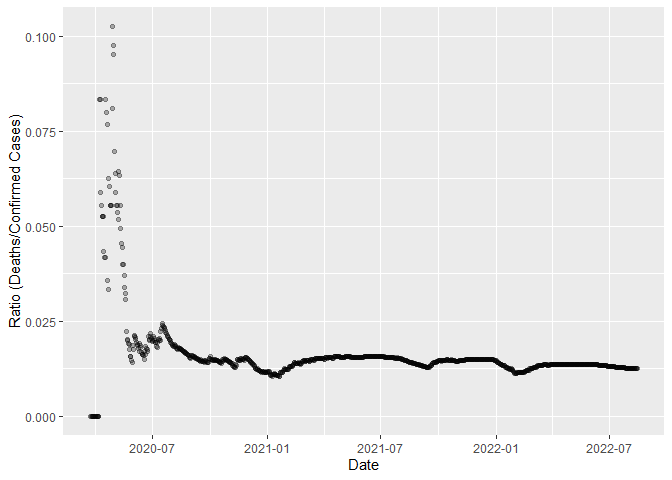
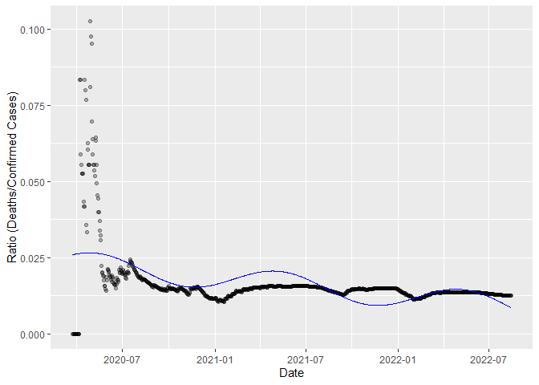
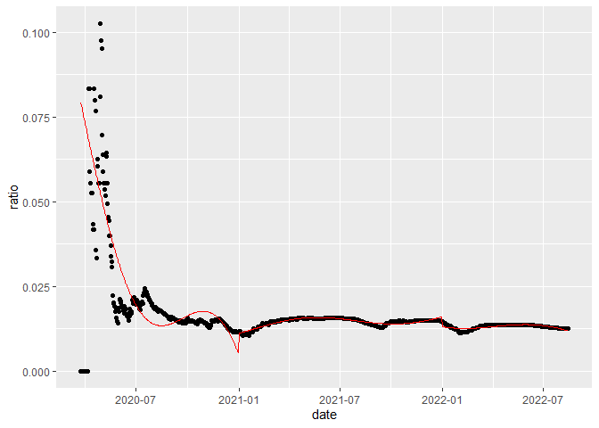
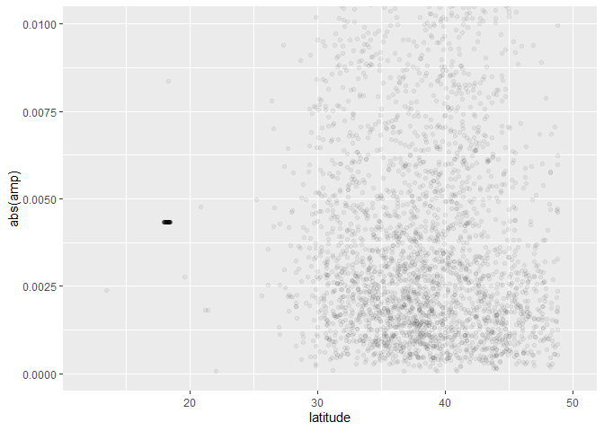
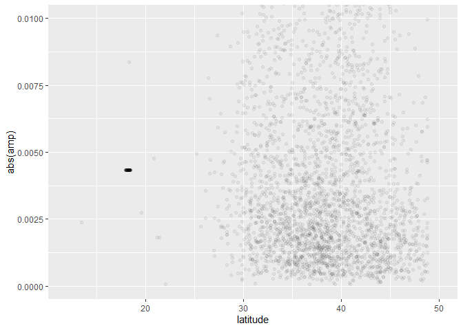
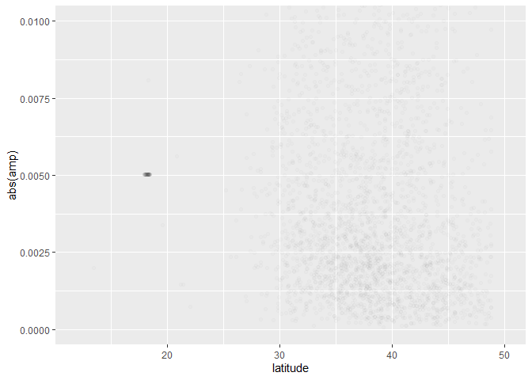
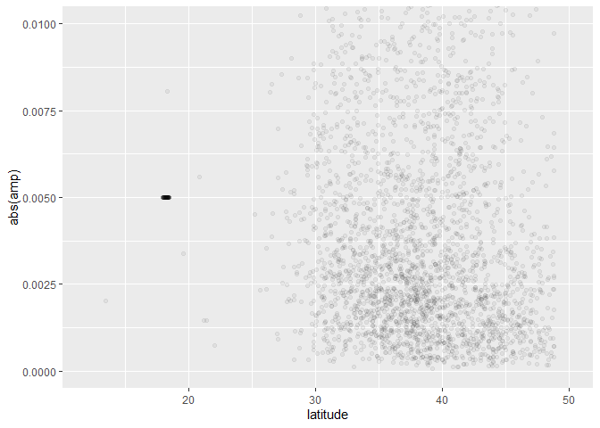

COVID-19 Morbidity and Seasonal Trends
================
Charles Fraley
2022-08-15

# Goal of Analysis

I’ll be evaluating if there’s a latitude influenced seasonal aspect to
COVID mortality rates. This question is influenced by the knowledge that
weather and climate has an influence on respiratory illness. If COVID
deaths are largely related to respiratory distress, there may be a
notable trend.

# Data

<!-- Was the source and a short description of the data provided? -->

## Intake and Source

I’ll be using the [time series COVID-19
Data](https://github.com/CSSEGISandData/COVID-19/tree/master/csse_covid_19_data/csse_covid_19_time_series)
from the Center for Systems Science and Engineering at Johns Hopkins.

``` r
url_in <- "https://github.com/CSSEGISandData/COVID-19/raw/master/csse_covid_19_data/"
time_path <- "csse_covid_19_time_series/time_series_covid19_"
time_filenames <- c(
    "confirmed_US.csv",
    #"confirmed_global.csv",
    #"deaths_global.csv",
    "deaths_US.csv"
)
for (branch_url in time_filenames) {
  time_data <- read.csv(
    url(
      paste(url_in,time_path,branch_url,sep="")
      )
    )
  assign(
    substring(branch_url,1,nchar(branch_url)-4),
    time_data
    )
}
```

# Demonstration of Method

I will be demonstrating my analysis using a single data entry:

    ## [1] "Autauga, Alabama, US"

A new data frame for each row is made using each row from the confirmed
and death spreadsheets. I use dates from either file’s column headers.
As dates come in the form of `Xmm-dd-yy` format, there is some
transformation required to get a date object. We get the mortality ratio
from
.
We remove any measurement of mortality ratio that is undefined or 0 as
these can be considered an issue of measurement from early in the
pandemic.

``` r
working_df <- data.frame(
  date = colnames(deaths_US[-(1:12)]),
  confirmed=as.numeric(
      t(confirmed_US[1,])[-(1:11)]
     ),
  dead=as.numeric(t(deaths_US[1,])[-(1:12)])
)
working_df$date <- mdy(substring(working_df$date,2))
working_df <- mutate(working_df,ratio=dead/confirmed)
working_df <- mutate(working_df,datenum=as.numeric(date-mdy("12-31-2019")))
working_df <- mutate(working_df,
                     no_year=yday(date)
)
working_df <- na.omit(working_df)
# is.finite(working_df$ratio) & working_df$ratio!=0
```

<!-- -->

I’ll be trying to fit this data to the below formula.
-C_{trend}*t+C_{Intercept\ offset}")

I considered 2 approaches to this question: 1. Fit all data to one time
axis with one fit. 2. Separate time data by year and create 3 different
fits per year. 3. Combine all data into one “combined year”. As the time
axis, use only the number of days since January 1st of that year.

## 1. Fit all data to one time axis with one fit

This would be the most intuitive way to handle it, handling all data as
a single trend that can be considered.
<!-- TODO figure out what's with this --> From our working dataframe
assign a fit:

    ## 
    ## Formula: ratio ~ a * sin((2 * pi * datenum + b)/365) - c * datenum + d
    ## 
    ## Parameters:
    ##     Estimate Std. Error t value Pr(>|t|)    
    ## a  4.034e-03  4.490e-04   8.984   <2e-16 ***
    ## b -2.541e+03  4.137e+01 -61.413   <2e-16 ***
    ## c  1.638e-05  1.261e-06  12.991   <2e-16 ***
    ## d  2.453e-02  7.312e-04  33.546   <2e-16 ***
    ## ---
    ## Signif. codes:  0 '***' 0.001 '**' 0.01 '*' 0.05 '.' 0.1 ' ' 1
    ## 
    ## Residual standard error: 0.009384 on 870 degrees of freedom
    ## 
    ## Number of iterations to convergence: 7 
    ## Achieved convergence tolerance: 2.473e-06

    ##     Min.  1st Qu.   Median     Mean  3rd Qu.     Max. 
    ## 0.008496 0.012579 0.015714 0.016464 0.019896 0.026536

<!-- -->

## 2. Exploration of Multiple Separate Year Evaluation

To avoid trying to model larger trends in the pandemic, we can take each
year as a separate thing to model and use a more basic linear trend to
mitigate that effect.

1.  Separate year as own variable

2.  Similar handling except run 3 times. Separating model by year.

<!-- -->

    ## 
    ## Formula: ratio ~ a * sin((2 * pi * no_year + b)/365) - c * no_year + d
    ## 
    ## Parameters:
    ##    Estimate Std. Error t value Pr(>|t|)    
    ## a 8.428e-03  2.650e-03   3.180  0.00164 ** 
    ## b 1.452e+01  1.127e+02   0.129  0.89759    
    ## c 4.990e-05  3.210e-05   1.555  0.12118    
    ## d 3.457e-02  7.287e-03   4.744 3.36e-06 ***
    ## ---
    ## Signif. codes:  0 '***' 0.001 '**' 0.01 '*' 0.05 '.' 0.1 ' ' 1
    ## 
    ## Residual standard error: 0.01479 on 279 degrees of freedom
    ## 
    ## Number of iterations to convergence: 5 
    ## Achieved convergence tolerance: 3.319e-07

    ## 
    ## Formula: ratio ~ a * sin((2 * pi * no_year + b)/365) - c * no_year + d
    ## 
    ## Parameters:
    ##     Estimate Std. Error t value Pr(>|t|)    
    ## a  2.038e-03  5.675e-05   35.90   <2e-16 ***
    ## b -1.736e+02  7.794e+00  -22.27   <2e-16 ***
    ## c -1.350e-05  4.067e-07  -33.20   <2e-16 ***
    ## d  1.200e-02  7.912e-05  151.63   <2e-16 ***
    ## ---
    ## Signif. codes:  0 '***' 0.001 '**' 0.01 '*' 0.05 '.' 0.1 ' ' 1
    ## 
    ## Residual standard error: 0.0005127 on 361 degrees of freedom
    ## 
    ## Number of iterations to convergence: 4 
    ## Achieved convergence tolerance: 4.388e-06

    ## 
    ## Formula: ratio ~ a * sin((2 * pi * no_year + b)/365) - c * no_year + d
    ## 
    ## Parameters:
    ##    Estimate Std. Error t value Pr(>|t|)    
    ## a 2.324e-03  2.164e-04   10.74   <2e-16 ***
    ## b 1.316e+04  1.623e+01  811.02   <2e-16 ***
    ## c 2.369e-05  2.659e-06    8.91   <2e-16 ***
    ## d 1.538e-02  3.061e-04   50.24   <2e-16 ***
    ## ---
    ## Signif. codes:  0 '***' 0.001 '**' 0.01 '*' 0.05 '.' 0.1 ' ' 1
    ## 
    ## Residual standard error: 0.0005099 on 222 degrees of freedom
    ## 
    ## Number of iterations to convergence: 6 
    ## Achieved convergence tolerance: 3.317e-07

<!-- -->

I did not use this in final analysis as the split is artificial and
arbitrary.

## 3. Combined Year

I take every data point as a part of a single year. The independent
variable is only the number of days since the start of the year.

    ## 
    ## Formula: ratio ~ a * sin((2 * pi * no_year + b)/365) - c * no_year + d
    ## 
    ## Parameters:
    ##     Estimate Std. Error t value Pr(>|t|)    
    ## a -5.881e-03  7.350e-04  -8.001 3.93e-15 ***
    ## b  9.713e+02  3.525e+01  27.551  < 2e-16 ***
    ## c -2.191e-05  5.592e-06  -3.918 9.62e-05 ***
    ## d  1.195e-02  1.092e-03  10.947  < 2e-16 ***
    ## ---
    ## Signif. codes:  0 '***' 0.001 '**' 0.01 '*' 0.05 '.' 0.1 ' ' 1
    ## 
    ## Residual standard error: 0.01016 on 870 degrees of freedom
    ## 
    ## Number of iterations to convergence: 8 
    ## Achieved convergence tolerance: 7.215e-09

<!-- -->

# Analysis

Map each area of examination to their latitude

For measuring across multiple locations I’ll be using the all as one
year analysis. Additionally I will be disregarding the ratio values of 0
at the beginning of the pandemic as these are clearly an issue of how
data was collected when COVID emerged. From each county, I need the
value for periodic amplitude for the model and the latitude.

## Collective Curve

    ## Warning: Removed 104 rows containing missing values (geom_point).

<!-- -->

    ## Warning: Removed 104 rows containing missing values (geom_point).

<!-- -->

## Combined Year

No apparent correlation.

    ## Warning: Removed 104 rows containing missing values (geom_point).

<!-- -->
If there was a shared seasonal periodicity, there would be similarity
across latitude of the offset of the period.

    ## Warning: Removed 104 rows containing missing values (geom_point).

<!-- -->

### Correlation latitude of counties to their periodic amplitude

    ## Warning: Removed 104 rows containing missing values (geom_point).

<!-- -->

# Conclusion

It doesn’t appear there is a relation between periodic changes in
mortality and latitude based on my model. This is encouraged by the lack
of correlation in the offset.

## Methodological Considerations

US focus because going across country lines means even more variability.
Special consideration would need to be given to vaccine availability and
differences in national health care. This would be beyond the scope of
this analysis.

### Assumptions

-   Period of 1 year
-   Skip past 0 deaths

# Further questions

Consider state and country analysis. Better larger trend mitigation.
Global averages/regional neighbor average.

## Bias and Mitigation

# TODO

-   Fix the offset amplitude flip mutation
-   offset %%365 or %%(365/2) comparison
-   [Suppress
    warnings](https://stackoverflow.com/questions/13286531/how-to-suppress-warnings-when-plotting-with-ggplot)
